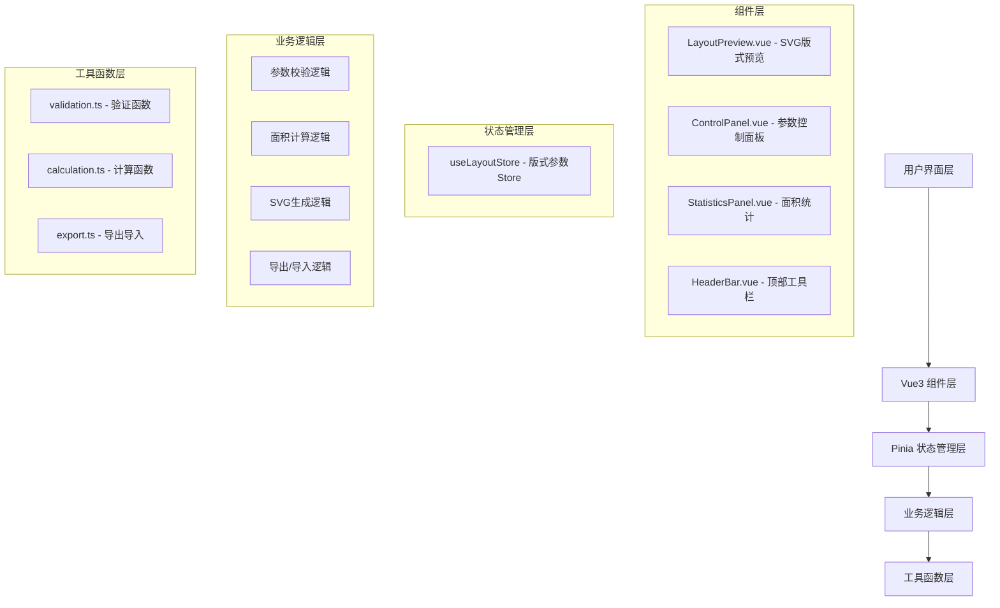
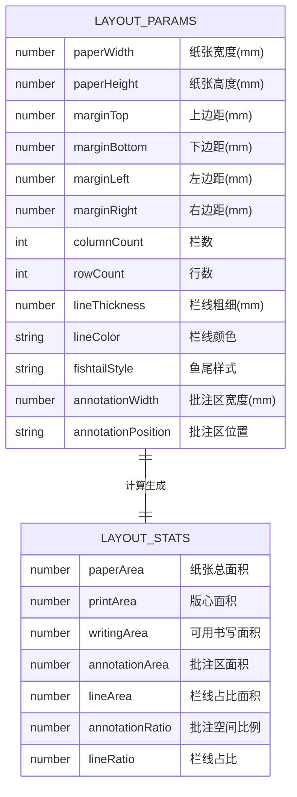

## 1. 架构设计
本项目为纯前端单页应用，采用Vue3组合式API进行开发，使用Pinia进行状态管理，SVG进行矢量图形渲染，Naive UI提供组件库支持。



## 2. 技术描述
- **前端框架**：Vue@3.4 + TypeScript@5.3 + Vite@5.0
- **状态管理**：Pinia@2.1
- **UI组件库**：Naive UI@2.38
- **样式方案**：Tailwind CSS@3.4 + CSS变量
- **矢量渲染**：原生SVG 2.0
- **图标库**：@vicons/ionicons5
- **初始化工具**：vite-init
- **后端**：无（纯前端应用）
- **数据库**：LocalStorage 持久化

## 3. 目录结构
```
src/
├── components/          # 组件目录
│   ├── HeaderBar.vue        # 顶部工具栏
│   ├── ControlPanel.vue     # 参数控制面板
│   ├── LayoutPreview.vue    # SVG版式预览
│   └── StatisticsPanel.vue  # 面积统计面板
├── stores/              # Pinia状态管理
│   └── useLayoutStore.ts    # 版式参数Store
├── types/               # TypeScript类型定义
│   └── layout.ts            # 版式相关类型
├── utils/               # 工具函数
│   ├── validation.ts        # 参数校验
│   ├── calculation.ts       # 面积计算
│   └── export.ts            # 导出导入
├── App.vue              # 根组件
├── main.ts              # 入口文件
└── style.css            # 全局样式
```

## 4. 路由定义
| 路由 | 用途 |
|-------|---------|
| / | 主页面，包含所有功能模块 |

## 5. 数据模型

### 5.1 数据模型定义


### 5.2 类型定义
```typescript
// 版式参数接口
interface LayoutParams {
  paperWidth: number;
  paperHeight: number;
  marginTop: number;
  marginBottom: number;
  marginLeft: number;
  marginRight: number;
  columnCount: number;
  rowCount: number;
  lineThickness: number;
  lineColor: string;
  fishtailStyle: FishtailType;
  annotationWidth: number;
  annotationPosition: AnnotationPosition;
}

// 版式统计接口
interface LayoutStats {
  paperArea: number;
  printArea: number;
  writingArea: number;
  annotationArea: number;
  lineArea: number;
  annotationRatio: number;
  lineRatio: number;
}

// 鱼尾样式类型
type FishtailType = 'none' | 'single' | 'double' | 'triple' | 'flowery';

// 批注区位置类型
type AnnotationPosition = 'left' | 'right' | 'both';

// 校验结果接口
interface ValidationResult {
  valid: boolean;
  errors: string[];
}

// 导出方案接口
interface LayoutExport {
  version: string;
  name: string;
  createdAt: string;
  params: LayoutParams;
}
```

## 6. 核心技术方案

### 6.1 SVG渲染方案
- 使用SVG的viewBox属性实现自适应缩放
- 利用defs定义可复用的鱼尾图案
- 使用group元素组织不同层级（纸张、版心、栏线、批注区）
- 添加pattern元素实现纸张纹理效果

### 6.2 状态管理方案
- Pinia Store集中管理所有版式参数
- 使用computed属性实时计算版心尺寸和统计数据
- action方法处理参数更新、重置、导入导出
- 通过watch实现参数变更时的自动校验

### 6.3 参数校验方案
- 编写独立的validation.ts工具函数
- 所有参数修改先经过校验再更新状态
- 校验规则：尺寸>0、版心不超出纸张、栏数行数为正整数、批注区不挤占正文
- 实时显示错误提示，阻止非法参数提交

### 6.4 导出导入方案
- 使用JSON格式存储版式参数
- 导出时添加版本号和时间戳
- 导入时进行版本兼容检查和参数校验
- 支持LocalStorage自动保存当前方案

### 6.5 性能优化
- SVG元素使用key绑定，减少不必要的重绘
- 计算属性缓存统计结果，避免重复计算
- 使用throttle限制高频参数调整时的重绘频率
- 大尺寸SVG使用transform优化渲染性能
